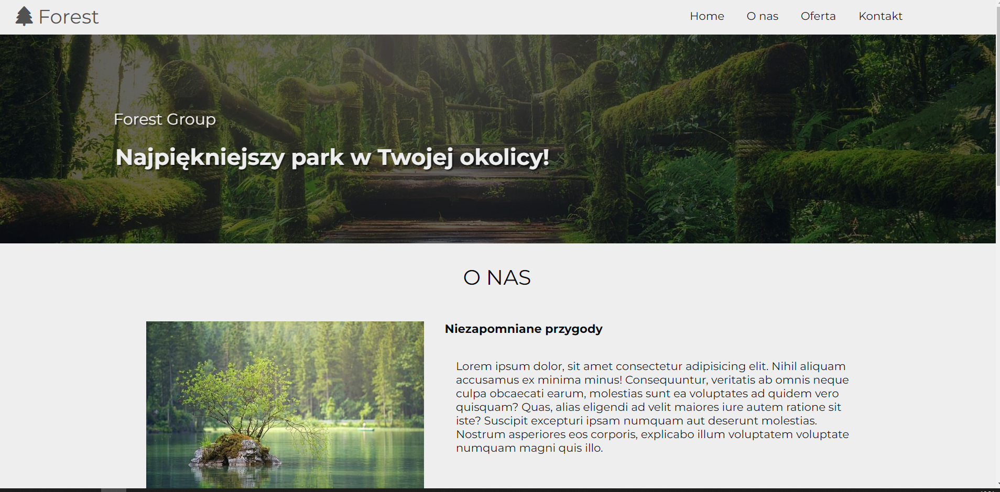

# Forest Group
> The Forest Group project is the first simulation of a commercial project. It is a website containing two subpages using HTML, CSS and javascript basics. Project Forest Group is the conclusion and summary of the knowledge gained from the MMCSchool course Web development course - part IV.
> Live demo [_here_](https://astilion.github.io/ForestGroup/). 

## Table of Contents
* [General Info](#general-information)
* [Technologies Used](#technologies-used)
* [Features](#features)
* [Screenshots](#screenshots)
* [Setup](#setup)
* [Usage](#usage)
* [Project Status](#project-status)
* [Room for Improvement](#room-for-improvement)
* [Acknowledgements](#acknowledgements)
* [Contact](#contact)
<!-- * [License](#license) -->

## General Information
The project is the culmination of work with the MMC School web development course.
Contains:
- a page with two subpages
- sections: About us, Offer, Contact.
Celem projektu jest przećwiczenie HTML, CSS, podstaw JavaScript, gulp, git, github i Sass.

## Technologies Used
- HTML5
- Javascript
- Css
- Sass Compiler - v1.58.0
- Gulp - v4.0.2

## Screenshots

## Setup
Project Doesn't need instalation, just run live demo [_here_](https://astilion.github.io/ForestGroup/).

## Project Status
Project is: _complete_ 

## Acknowledgements

- Many thanks to Mateusz Maj, creator of MMC School, udemy teacher - (_link_) (https://www.udemy.com/user/majek-2/).
